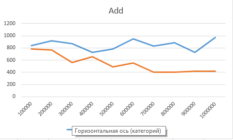
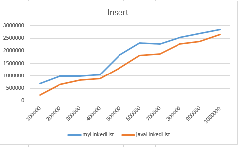
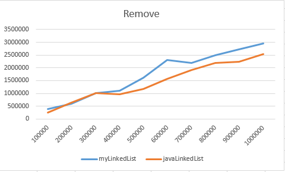
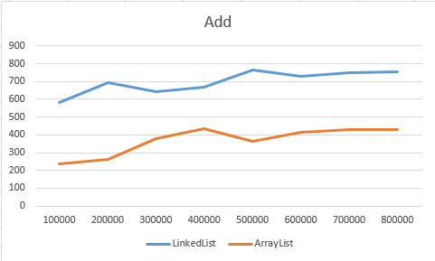
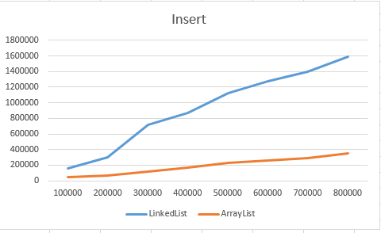
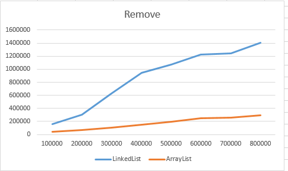
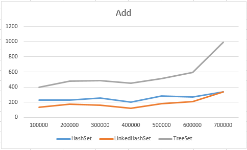
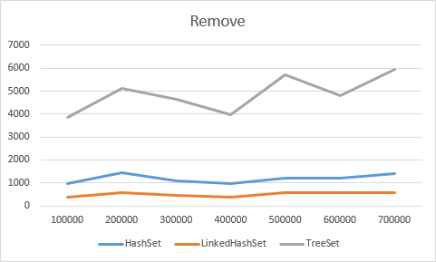

## Сравнение эффективности операций на стороннем и встроенном LinkedList

### Добавление элемента в конец списка

### Вставка элемента в середину списка

### Удаление элемента из середины списка

## Сравнение эффективности операций на LinkedList и ArrayList

### Добавление элемента в конец списка

### Вставка элемента в середину списка

### Удаление элемента из середины списка

## Сравнение эффективности операций на HashSet, LinkedHashSet и TreeSet

### Добавление элемента в конец

### Удаление элемента из середины

## Сравнение эффективности операций на HashMap, LinkedHashMap и TreeMap

### Добавление элемента в конец

### Удаление элемента из середины
