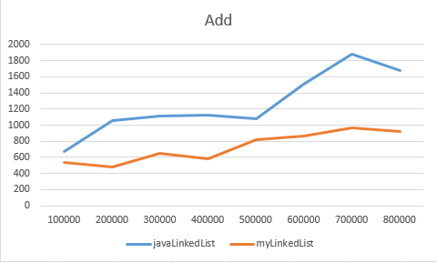

## Сравнение эффективности операций на стороннем и встроенном LinkedList

### Добавление элемента в конец списка

### Вставка элемента в середину списка

### Удаление элемента из середины списка

Моя реализация LinkedList оказалась более эффективной при вставке в конец, но при остальных операциях, не превосходит и не уступает встроенной реализации по эффективности.

## Сравнение эффективности операций на LinkedList и ArrayList

### Добавление элемента в конец списка

### Вставка элемента в середину списка

### Удаление элемента из середины списка

### Вставка элемента в начало списка

|  | 100000 | 200000 | 300000 | 400000 | 500000 | 600000 | 700000 | 800000 |
| --- | --- | --- | --- | --- | --- | --- | --- | --- |
| LinkedList | 3165 | 2770 | 2310 | 3325 | 3015 | 3630 | 5545 | 6475 |
| ArrayList | 99355 | 140685 | 207215 | 301125 | 368610 | 512565 | 664755 | 1389115 |

### Удаление элемента в начало списка

|  | 100000 | 200000 | 300000 | 400000 | 500000 | 600000 | 700000 | 800000 |
| --- | --- | --- | --- | --- | --- | --- | --- | --- |
| LinkedList | 2935 | 2275 | 1835 | 2750 | 2565 | 3325 | 4840 | 5700 |
| ArrayList | 94235 | 139125 | 197255 | 283365 | 339325 | 488305 | 612370 | 1085770 |

ArrayList эффективнее LinkedList во всех представленных операциях, причем в случае вставки в середину или удаления из середины при увеличении количества элементов в списке ArrayList превосходит LinkedList в разы. Однако, в случае вставки в начало или удаления из начала LinkedList эффективнее в десятки, а то и сотни раз.
Значит, наиболее эффективным использование LinkedList будет в случае, когда задача требует множественное выполнение операций вставки в начало и удаления из начала. В остальных случаях, эффектинее использовать ArrayList.

## Сравнение эффективности операций на HashSet, LinkedHashSet и TreeSet

### Добавление элемента

### Удаление элементa

Операции на HashSet и LinkedHashSet имеют практически одинаковую эффективность, TreeSet же уступает им, так как элементы в нем отсортированы.

## Сравнение эффективности операций на HashMap, LinkedHashMap и TreeMap

### Добавление элемента

### Удаление элемента

Операции на HashMap и LinkedHashMap имеют практически одинаковую эффективность, TreeMap же уступает им, так как элементы в нем отсортированы.